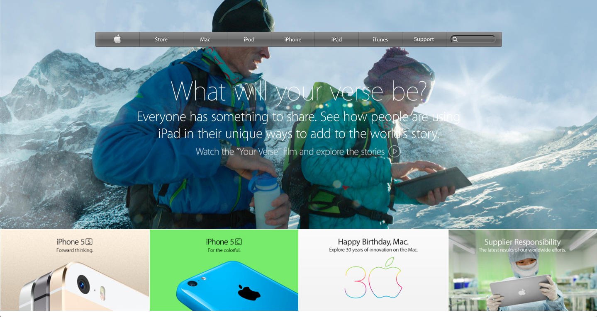

# 2014 Apple Website Clone

> A clone of the 2014 Apple website.

This project demonstrates the usage of different CSS background styling methods.

## Built With

- HTML,
- CSS,

## Live Demo

[Live Demo Link](https://rawcdn.githack.com/mohammadumar28/old-apple-website/8dccf75952044fda8ad5af6d2363e454bb8a7048/index.html)

## Getting Started

**This is an example of how you may give instructions on setting up your project locally.**
**Modify this file to match your project, remove sections that don't apply. For example: delete the testing section if the currect project doesn't require testing.**

To get a local copy up and running download the repository and open the index.html file with a browser of your choice.

## Authors

👤 **Mohammad Umar**

- Github: [@mohammadumar28](https://github.com/mohammadumar28)

👤 **Mark Rode**

- Github: [@m15e](https://github.com/m15e)

## 🤝 Contributing

Contributions, issues and feature requests are welcome!

Feel free to check the [issues page](issues/).

## Show your support

Give a ⭐️ if you like this project!

## Acknowledgments

- Apple.com
- The Odin Project

## 📝 License

This project is [MIT](lic.url) licensed.